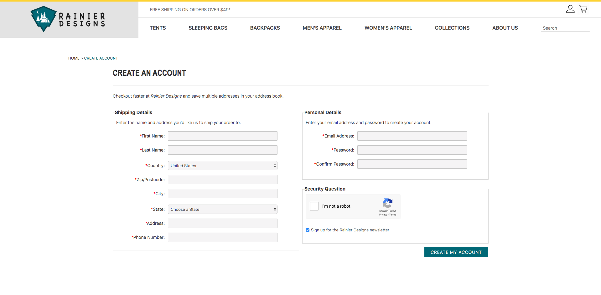
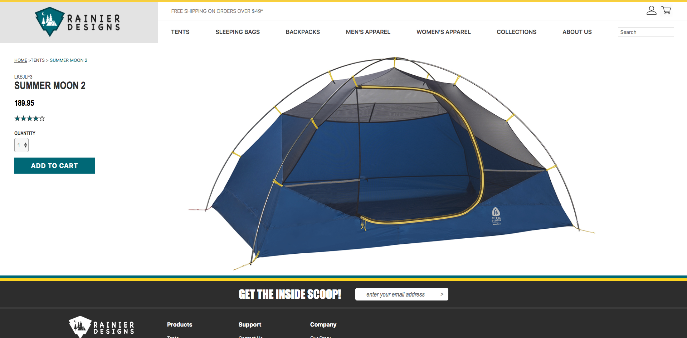
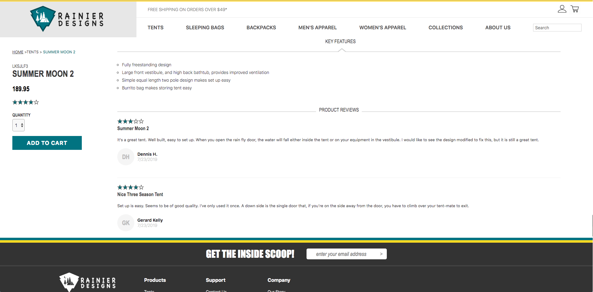

# Rainier Designs
An E-commerce web-app to showcase and sell camping gear. Project started in June 2019. Designed and styled as a clone of sierradesigns.com .
### Purpose
I decided to build this site for my own educational purposes only. All retail information is mock but the site is made to be fully functional. I wanted to build something of decent scale that implemented some sort of payment API. I also was looking to gain more experience and deeper understanding of Redux global state management since this concept & technology is fairly new to me.
### Technologies
- **Java** back-end with **Spring Boot** server
- **MySQL** database
- **ReactJS** front-end
- **Redux** (thunk) state management system
- **CSS Flexbox**
### Functionality
- User's can create and edit profiles, browse products, leave reviews, and add/remove items from personal shopping cart
- Item's can be added/updated/deleted from the database
- Products can be browsed by category and filtered by price & rating
### To-Do's
- Seperate Admin permissions
- Integrate Stripe payment API
- Sub-category dropdown menus
### Screenshots

